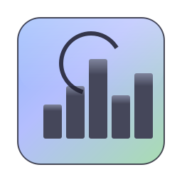
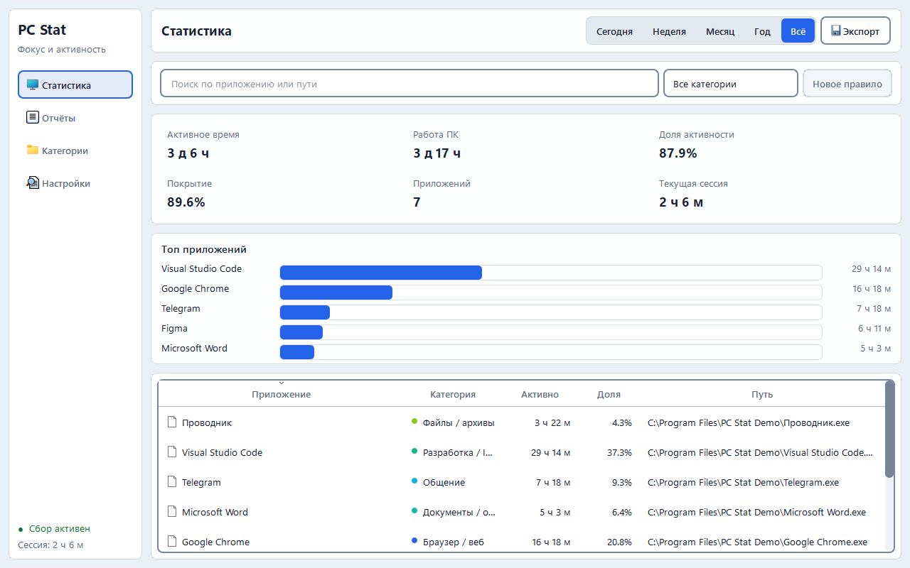
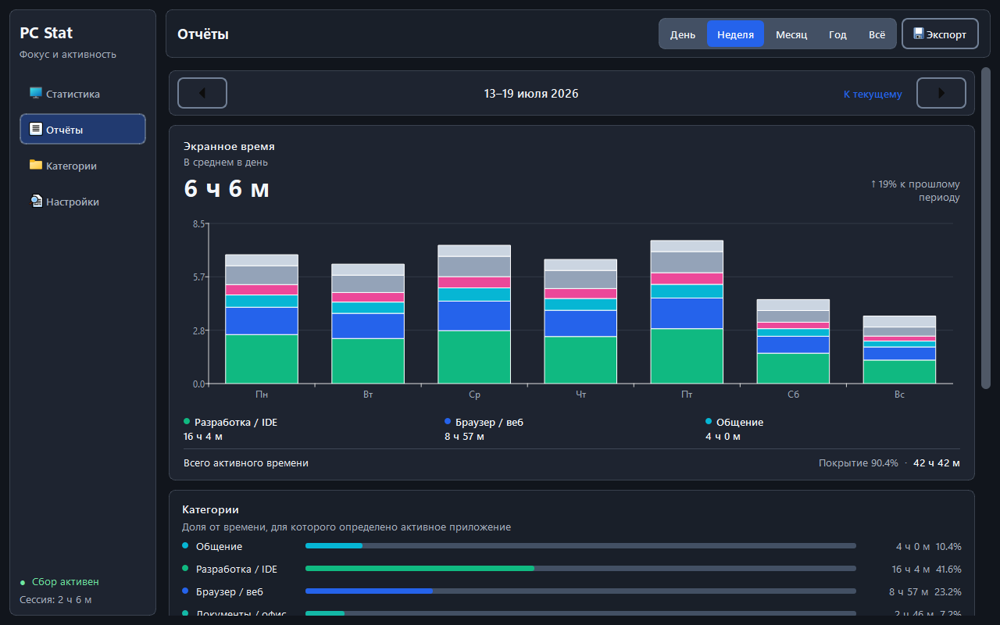

# PC Stat 1.3.1

<div align="center">
  
  <p><strong>Локальная статистика активности для Windows 11</strong></p>
  <p>Показывает, сколько времени вы действительно работали за компьютером, какие приложения были активны и как менялась нагрузка по дням, неделям, месяцам и годам.</p>
  <p>
    <a href="https://github.com/kooal-111/pc_stat_WIN/releases/latest"><strong>Скачать PCStat.exe</strong></a>
    · <a href="PRIVACY.md">Конфиденциальность</a>
    · <a href="SECURITY.md">Безопасность</a>
  </p>
</div>

PC Stat работает в области уведомлений Windows и учитывает только активное окно. После достижения порога AFK время перестаёт начисляться. Все данные остаются на компьютере пользователя в локальной SQLite-базе: приложению не нужны аккаунт, сервер или облачная синхронизация.

## Интерфейс

### Статистика и приложения



### Календарные отчёты



> На скриншотах используются только синтетические данные и вымышленные пути. Пользовательская база для документации не открывается.

## Возможности

- **Активное время ПК** — считается только при недавнем вводе с клавиатуры или мыши.
- **Время по приложениям** — учитывается foreground-процесс, а не просто открытые в фоне программы.
- **Календарные отчёты** — день, неделя, месяц, год и всё время с переходом к предыдущим периодам.
- **Понятные графики** — часы, дни недели, числа месяца и русские названия месяцев без обрезанных ISO-дат.
- **Категории** — браузеры, разработка, документы, общение, медиа, игры, дизайн, AI-инструменты и другие группы.
- **Свои правила** — категорию можно назначить по имени файла или части пути и изменить приоритет правила.
- **Поиск и фильтрация** — быстрый поиск по приложению и пути, фильтр категории и числовая сортировка.
- **CSV-экспорт** — приложения, активное время и категории за выбранный период.
- **Трей и автозапуск** — фоновый запуск без создания главного окна, открытие через область уведомлений.
- **Светлая, тёмная и системная темы** — Mica на поддерживаемой Windows 11 и непрозрачный fallback.

## Как считается время

1. Раз в две секунды PC Stat проверяет последнее действие пользователя и активное окно.
2. Если пользователь не AFK, текущий интервал ПК и приложения продолжается.
3. При смене приложения, AFK, sleep или выходе интервал закрывается.
4. Интервалы буферизуются и сохраняются одним batch примерно раз в 30 секунд.

Большой разрыв после сна или перевода системных часов не начисляется как активность. Для длительности используется монотонный таймер, а обычное системное время применяется только для временных меток.

## Конфиденциальность

PC Stat **не использует сеть, телеметрию или рекламные SDK**. Основная база находится в `%LOCALAPPDATA%\pc_stat_win\data.sqlite`, а журналы — в `%LOCALAPPDATA%\pc_stat_win\logs\pc_stat.log`.

- Сохранение заголовков окон по умолчанию выключено и включается только пользователем.
- При отключении ранее сохранённые заголовки удаляются из основной базы и WAL.
- CSV создаётся только после явного нажатия кнопки экспорта и сохраняется в выбранный файл.
- Историю можно ограничить сроком 30, 90, 180 или 365 дней либо полностью удалить из настроек.
- Сетевой клиент в runtime-модулях запрещён автоматическим тестом.

Подробное описание собираемых данных: [`PRIVACY.md`](PRIVACY.md).

**Имена и иконки приложений:** имя берётся из ресурсов Windows (`FileDescription` / `ProductName`), а иконка — через системный механизм Проводника. Эти данные не отправляются наружу.

## Скачать и запустить

1. Откройте [последний GitHub Release](https://github.com/kooal-111/pc_stat_WIN/releases/latest).
2. Скачайте portable-файл `PCStat.exe` и при необходимости `SHA256SUMS.txt`.
3. Запустите `PCStat.exe`. Установка Python не требуется.

Windows может показать предупреждение неизвестного издателя, пока проект не подписан коммерческим Authenticode-сертификатом. CI-артефакт получает GitHub/Sigstore provenance attestation:

```powershell
gh attestation verify PCStat.exe --repo kooal-111/pc_stat_WIN
```

Закрытие окна сворачивает приложение в трей. Полный выход доступен через меню значка PC Stat. Автозапуск включается вручную в настройках и создаёт запись только для текущего пользователя Windows.

### Локальный установщик

Официальный релиз — один portable EXE. При установленном Inno Setup 6 можно дополнительно собрать обычный установщик:

```powershell
.\scripts\build_installer.ps1
```

Результат: `installer\output\PCStat-Setup.exe`. Пользовательская база при установке и обновлении не удаляется.

## Для разработчиков

### Стек

- Python 3.11
- PySide6 / QtWidgets / QtCharts
- SQLite с WAL и `synchronous=NORMAL`
- PyInstaller и GitHub Actions для Windows-сборок

### Основные модули

| Модуль | Ответственность |
| --- | --- |
| `pc_stat_win/collector.py` | AFK, foreground-процесс, монотонное время и буферизация интервалов |
| `pc_stat_win/db.py` | схема SQLite, миграции, агрегаты периода и категории |
| `pc_stat_win/periods.py` | календарные диапазоны и русские заголовки периодов |
| `pc_stat_win/ui/main_window.py` | навигация, таблица, настройки и жизненный цикл окна |
| `pc_stat_win/ui/reports_tab.py` | Screen Time-подобные отчёты и ленивые QtCharts |
| `pc_stat_win/single_instance.py` | mutex и локальный IPC повторного запуска |

### Запуск из исходников

```powershell
git clone https://github.com/kooal-111/pc_stat_WIN.git
cd pc_stat_WIN
python -m venv .venv
.\.venv\Scripts\Activate.ps1
python -m pip install --require-hashes -r requirements-lock.txt
python -m pc_stat_win
```

Также можно запустить `PC Stat.bat`: он использует `.venv`, если окружение уже создано.

### Проверки

```powershell
python -m unittest discover -s tests
$env:QT_QPA_PLATFORM = "offscreen"
python scripts\smoke_ui_qt.py
python scripts\perf_db.py
python scripts\perf_ui_model.py
```

UI smoke проверяет страницы, темы и размеры `760×520`, `920×640`, `1280×800`. CI повторяет тесты при масштабе Qt 100%, 150% и 200%, запускает `pip-audit`, собирает onefile EXE и проверяет его на временной SQLite-базе.

Документационные скриншоты воспроизводятся без пользовательской базы:

```powershell
$env:PCSTAT_UI_NATIVE = "1"
python scripts\capture_readme_screenshots.py
```

Скрипт пишет только `docs/images/*.png` и использует синтетические приложения с нейтральными путями.

### Сборка

```powershell
# Папка dist\PCStat
.\scripts\build_windows.ps1

# Один dist\PCStat.exe
.\scripts\build_windows.ps1 -OneFile
```

Сборочные каталоги `build/`, `dist/`, `output/`, `PC Stat/` и `installer/output/` не должны попадать в Git. Зависимости закреплены версиями и SHA-256 в `requirements-lock.txt`.

Публикация репозитория без персональных данных описана в [`docs/GITHUB.md`](docs/GITHUB.md). Сообщения об уязвимостях принимаются по инструкции из [`SECURITY.md`](SECURITY.md).

## Версия и выпуск

Единственный источник версии — `APP_VERSION` в `pc_stat_win/version.py`. Релиз запускается из чистого Git checkout:

```powershell
.\scripts\publish_release.ps1
```

Скрипт ждёт успешный CI точного `HEAD`, скачивает аттестованный артефакт, проверяет checksum, версии файла, packaged smoke (`schema 7` и `PRAGMA quick_check`), затем публикует тег командой с параметрами `--verify-tag --target <HEAD> --repo <owner/name>`.

## Настройки

- **Тема** — системная, светлая или тёмная.
- **Автозапуск** — фоновый старт для текущего пользователя Windows.
- **Порог AFK** — время без ввода до остановки учёта.
- **Исключения** — процессы, которые не должны попадать в статистику приложений.
- **Заголовки окон** — отдельная опция, выключенная по умолчанию.
- **Срок хранения** — без ограничения или 30/90/180/365 дней.
- **Удалить статистику** — очищает интервалы и журнал загрузок, сохраняя настройки категорий.

## Ограничения

- Учитывается активное окно, а не время существования процесса в фоне.
- Без расширения браузера нельзя получить полный список открытых вкладок.
- Оценка uptime по журналу загрузок Windows не различает сон и обычную работу без дополнительных системных событий.
